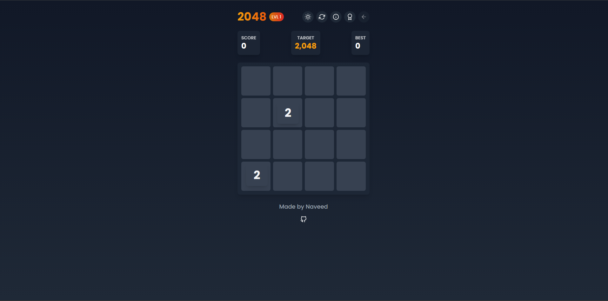

# 2048 Game



🎮 A modern, feature-rich implementation of the classic 2048 puzzle game! Merge tiles to reach 2048 and beyond!

**Play now: [2048-by-nino.netlify.app](https://2048-by-nino.netlify.app/)**

## ✨ Features

- 🌓 **Dark/Light Mode** - Play in your preferred visual style
- 🎯 **Multiple Levels** - Challenge yourself with increasing difficulty as you progress
- 🏆 **Achievement System** - Unlock achievements as you reach milestones
- 🔄 **Undo Move** - Made a mistake? No problem! Take back your last move
- 📱 **Fully Responsive** - Play seamlessly on any device
- 🎵 **Sleek Animations** - Enjoy smooth tile movements and merges
- 💾 **Local Storage** - Your progress is automatically saved
- 🔢 **Smart Scaling** - Tile font size adjusts for larger numbers

## 🚀 Technologies Used

- ⚛️ **React** - UI components and state management
- 🎭 **Framer Motion** - Smooth animations and transitions
- 💅 **Tailwind CSS** - Responsive styling and dark mode support
- 🖌️ **React Icons** - Beautiful, customizable icons
- 🧱 **Vite** - Fast development and production builds

## 🎮 How to Play

1. Use arrow keys (↑ ↓ ← →) or swipe to move tiles
2. When two tiles with the same number touch, they merge into one!
3. Reach the target number (2048, 4096, etc.) to beat each level
4. Keep going to see how far you can get!

## 🛠️ Setup and Development

### Prerequisites

- Node.js (v14 or later)
- npm or yarn

### Installation

1. Clone the repository:
   ```bash
   git clone https://github.com/yourusername/2048-game.git
   cd 2048-game
   ```

2. Install dependencies:
   ```bash
   npm install
   # or
   yarn
   ```

3. Start the development server:
   ```bash
   npm run dev
   # or
   yarn dev
   ```

4. Open your browser and navigate to `http://localhost:5173`

### Building for Production

```bash
npm run build
# or
yarn build
```

The built files will be in the `dist` directory, ready to be deployed.

## 🏆 Levels and Achievements

- **Level 1**: Target 2048
- **Level 2**: Target 4096
- **Level 3**: Target 8192
- **Level 4**: Target 16384

Each level introduces more initial tiles and a higher probability of 4's appearing, increasing the challenge.

## 🧠 Strategy Tips

- Focus on keeping your highest tiles in one corner
- Work to maintain a clear path to your high-value corner
- Don't move up/down and left/right in alternating sequence
- Plan several moves ahead whenever possible

## 📝 License

MIT License

## 🙏 Acknowledgements

- Inspired by the original 2048 game by Gabriele Cirulli
- Built with passion and caffeine

---

Made with ❤️ by Nino
